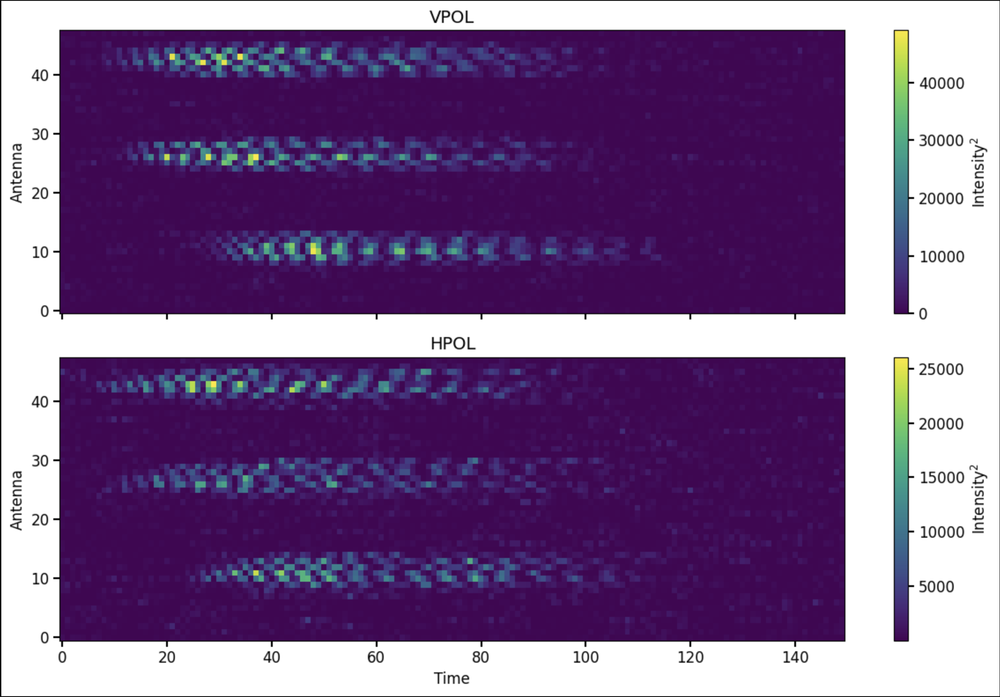
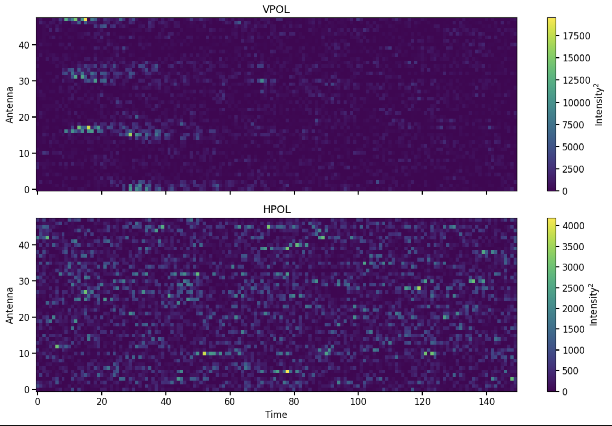
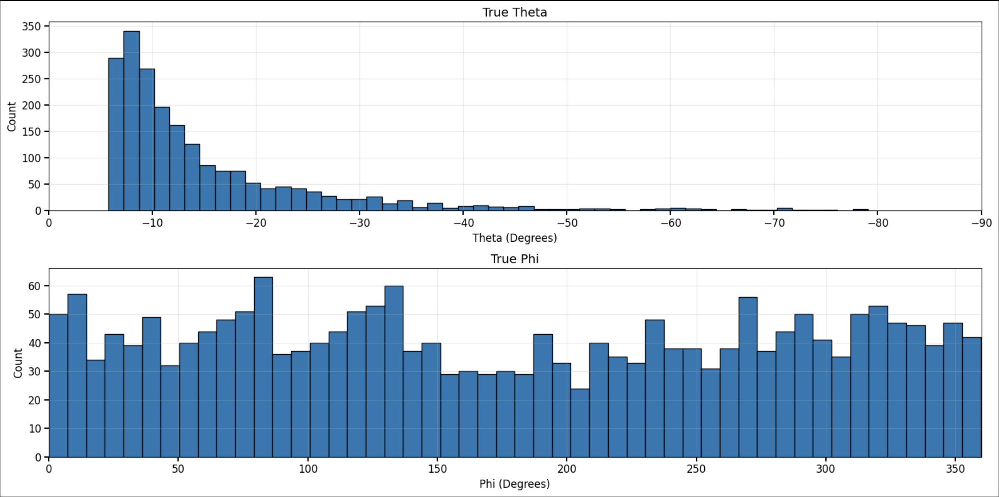

# Neutrino Direction Reconstruction

This repository is a cleaned portfolio version of a machine-learning workflow for neutrino arrival-direction reconstruction using simulated ANITA-III event data.

The code was developed for a research workflow that used timing-map inputs and signal-to-noise ratio features to predict incoming particle direction. The broader project is ongoing, so the project data, trained CNN model, model checkpoints, and latest performance outputs are **not** included in this public repository.

This work was developed and trained using GPU resources on the Ohio Supercomputer Center (OSC). This repo is not intended to be a fully reproducible public research package.

---

## Project Overview

The goal of this workflow is to reconstruct the incoming direction of simulated neutrino events from detector-derived timing maps.

High-energy neutrinos are difficult to detect because they rarely interact with matter. Experiments such as ANITA search for radio signals produced when high-energy neutrinos interact in Antarctic ice. If a candidate event is detected, reconstructing its incoming direction is important because it is the first step to connecting it back to possible astrophysical sources.

Each simulated event includes:

- A two-channel timing map
- Signal-to-noise ratio features for vertical and horizontal polarization
- True angular labels:
  - `phi` ($\phi$): azimuthal heading
  - `theta` ($\theta$): elevation angle

The main model is a multi-input convolutional neural network that combines image-like timing-map information with SNR features. A Random Forest regressor is included as a simpler baseline model.

---

## Motivation

ANITA detects impulsive radio signals using an antenna array carried by a high-altitude balloon over Antarctica. When a high-energy neutrino interacts in ice, it can produce a particle shower that emits a coherent radio pulse. The observed timing pattern across the detector contains information about the arrival direction of that signal.

Traditional direction reconstruction relies on signal timing, detector geometry, and correlation-based methods. A machine-learning model can learn the mapping from simulated detector responses instead of manually reconstructing direction from timing correlations.

This workflow uses supervised learning (simulated events contain both detector-level inputs and true direction labels).

---

## Data

Each event is represented by timing-map and SNR information.

The timing map is stored with shape `(2, 48, 150)`. The two channels represent vertically and horizontally polarized detector timing maps, while the remaining dimensions represent the map structure used by the CNN.

Each event also includes two scalar SNR features: `snr_vpol` and `snr_hpol`.

The CNN uses both input types:

- Timing maps provide structured, image-like detector-response information
- SNR values provide compact signal-strength information

---

## Visual Examples

The figures below are representative visualizations that were used to develop this workflow. They are included to show the structure of the data and the prediction task.

### Clean Timing Map Example

This example shows a cleaner timing-map pattern where signal structure is visible across the detector channels. These structured patterns are the type of information the CNN is designed to learn from.

### Noise Timing Map Example

This example shows a noisier timing map where the signal is less visually distinct. These cases are more difficult because noise can obscure the timing structure needed for direction reconstruction.

### Representative Direction Distribution

The representative sample shows that elevation $\theta$ is concentrated near the horizon, especially between roughly $0^\circ$ and $-10^\circ$, then trails off at lower elevations. This is because events just below the horizon are more relevant for neutrino detection. The heading $\phi$ distribution is more evenly spread across all directions.

---

## Modeling Approach

This repository contains two modeling workflows:

1. A Random Forest baseline
2. A multi-input convolutional neural network

The Random Forest provides a simpler comparison model using flattened timing maps and SNR values. The CNN is the main model because it can learn directly from the spatial structure of the timing maps.

---

## Label Encoding

Instead of predicting $\phi$ directly as a single angle, the workflow encodes heading using sine and cosine components.

The label vector is stored as `[cos(phi), sin(phi), theta / 90]`.

This avoids the angular wraparound problem. For example, $359^\circ$ and $1^\circ$ are physically close directions, but they are numerically far apart if $\phi$ is predicted directly.

Using `cos(phi)` and `sin(phi)` lets the model learn azimuth as a continuous circular quantity. During evaluation, predictions are converted back into angles using `arctan2(sin_phi, cos_phi)` for heading and `theta = scaled_theta * 90` for elevation.

This encoding is used for both the CNN and Random Forest workflows.

---

## Preprocessing Pipeline

The preprocessing script prepares the data for both models.

Main preprocessing steps:

- Load simulated ANITA event data from pickle files
- Extract timing maps, SNR values, and true direction labels
- Square timing-map values to emphasize stronger signal structure
- Normalize each timing map by its maximum intensity
- Encode `phi` using sine and cosine
- Scale `theta` by 90
- Save processed NumPy arrays for training and evaluation
- Use memory-mapped arrays for larger CNN datasets

---

## Random Forest Baseline

The Random Forest model uses flattened timing-map features.

Each timing map begins with shape `(2, 48, 150)`. For the Random Forest, this is flattened into `2 * 48 * 150 = 14,400` timing-map features.

The two SNR values are then appended to the flattened timing-map vector. This creates a tabular feature matrix that can be passed into a Random Forest regressor.

The Random Forest baseline is useful because it tests whether direction information is present in the timing maps and SNR features before using a more expensive CNN model.

---

## CNN Architecture

The CNN is a multi-input model with two branches.

### Timing-Map Branch

The CNN timing-map arrays are stored as `(N, 2, 48, 150)`. Before entering TensorFlow, they are transposed into image format as `(N, 48, 150, 2)`.

The timing-map branch uses repeated convolutional blocks with:

- `Conv2D`
- Batch normalization
- ReLU activation
- Max pooling
- Dropout
- L2 regularization

This branch learns spatial patterns in the timing-map representation.

### SNR Branch

The SNR branch takes the two scalar SNR features with shape `(N, 2)`. These features are passed through dense layers before being combined with the timing-map representation.

### Combined Prediction Head

The timing-map branch and SNR branch are concatenated, then passed through dense layers.

The model has two output heads:

- `phi_output`: predicts `[cos(phi), sin(phi)]`
- `theta_output`: predicts `theta / 90`

This separates circular azimuth prediction from elevation-angle prediction.

---

## Training Strategy

The CNN training workflow was designed for GPU training on OSC.

Important training features include:

- Custom Keras `Sequence` generator for batch loading
- Memory-mapped NumPy arrays to avoid loading the full dataset into RAM
- Fixed random seed for the training/validation split
- Model checkpointing based on validation loss
- Learning-rate reduction when validation loss plateaus
- Early stopping to reduce overfitting
- Final model saving in Keras format

The SLURM script in this repository shows the intended HPC training setup, with private account and environment paths replaced by placeholders.

---

## Evaluation

The evaluation scripts load trained models, predict directions on test data, convert encoded outputs back into physical angles, and calculate approximate angular error.

The angular error is calculated from the wrapped `phi` error and the `theta` error. In plain terms, the workflow compares the predicted and true heading, wraps the heading difference correctly across the `0^\circ / 360^\circ` boundary, compares the predicted and true elevation, then combines the two errors into an approximate total angular error in degrees.

Current evaluation outputs are not included.

---

## Repository Structure

- `README.md`: project overview and workflow summary
- `.gitignore`: excludes data, models, outputs, logs, and cache files
- `sbatch_train_cnn.sh`: OSC/SLURM GPU training script
- `Figures/clean_timing_map.png`: clean timing-map example
- `Figures/noise_timing_map.png`: noisy timing-map example
- `Figures/angle_distribution.png`: representative direction-distribution figure
- `src/preprocess_data.py`: preprocessing for Random Forest and CNN workflows
- `src/train_random_forest.py`: Random Forest training
- `src/train_cnn.py`: multi-input CNN training
- `src/evaluate_random_forest.py`: Random Forest evaluation
- `src/evaluate_cnn.py`: CNN evaluation

---

## File Descriptions

### `src/preprocess_data.py`

Preprocesses simulated ANITA-III event data for both the Random Forest and CNN workflows.

It creates Random Forest arrays for training features, training labels, test features, and test labels. It also creates CNN arrays for timing maps, SNR values, and labels across training and test sets.

The CNN arrays are stored using memory maps so larger datasets can be processed without holding every array in memory at once.

### `src/train_random_forest.py`

Trains a Random Forest baseline model using flattened timing-map features and SNR values.

The trained model is saved as `models/random_forest.joblib`.

### `src/train_cnn.py`

Trains the multi-input CNN using timing maps and SNR features.

The trained model is saved as `models/anita_CNN.keras`.

This script is designed for GPU training on OSC or a similar HPC system.

### `src/evaluate_random_forest.py`

Evaluates a trained Random Forest model on preprocessed test data.

It saves the Random Forest error data to `outputs/random_forest_errors.npz` and the angular-error histogram to `figures/random_forest_angular_error.pdf`.

### `src/evaluate_cnn.py`

Evaluates a trained CNN model on preprocessed test data.

It saves the CNN error data to `outputs/cnn_errors.npz` and the angular-error histogram to `figures/cnn_angular_error.pdf`.

### `sbatch_train_cnn.sh`

SLURM batch script for training the CNN on an HPC GPU node.

The OSC account name and Python environment path have been replaced with placeholders.

---

## Expected Workflow

Order of the workflow is:

1. Create the output folders: `data`, `models`, `outputs`, `figures`, and `logs`
2. Run `src/preprocess_data.py`
3. Train the Random Forest baseline with `src/train_random_forest.py`
4. Submit the CNN training job with `sbatch_train_cnn.sh`
5. Evaluate the trained Random Forest model with `src/evaluate_random_forest.py`
6. Evaluate the trained CNN model with `src/evaluate_cnn.py`

The scripts are not expected to run directly from this public repository because the raw data, trained models, and private environment paths are not included.

---

## Technical Highlights

- Built preprocessing scripts for simulated detector-event data
- Used NumPy memory maps for large CNN-ready arrays
- Encoded angular labels with `sin(phi)` and `cos(phi)` to avoid wraparound discontinuities
- Implemented a Random Forest baseline for comparison
- Built a multi-input CNN combining timing maps and SNR features
- Used batch loading through a custom Keras generator
- Used TensorFlow/Keras callbacks for checkpointing, learning-rate scheduling, and early stopping
- Prepared GPU training workflow for OSC using SLURM
- Separated preprocessing, training, and evaluation into clean scripts

---

## Limitations

This repository intentionally excludes:

- Raw simulated ANITA-III event data
- Current project data
- Trained CNN model files
- Trained Random Forest model files
- Current evaluation outputs
- Current performance results
- Private HPC paths and account information

These exclusions are due to the ongoing nature of the research project.

This repository should therefore be read as a cleaned code sample and workflow summary, not as a complete reproducible release of the research project.

---

## Tools Used

- Python
- NumPy
- Pandas
- TensorFlow / Keras
- scikit-learn
- Matplotlib
- joblib
- SLURM
- Ohio Supercomputer Center
- Linux/HPC workflows